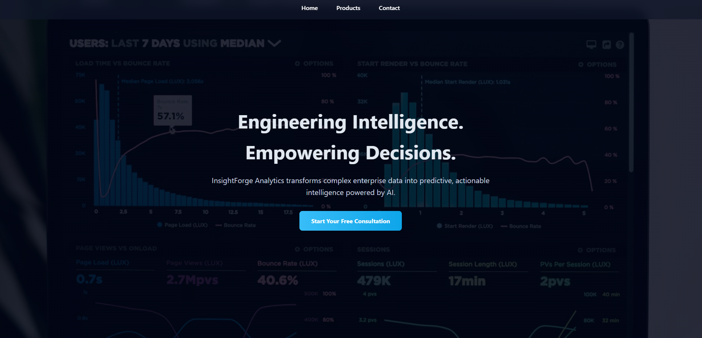

# E-Commerce Website (HTML & CSS)

## Project Overview
This project is a static e-commerce website created using HTML5 and CSS3.
It demonstrates responsive design, navigation, digital structure and services.

## Website Pages
- Home page
- product page
- Contact page

## Technologies Used
- HTML5
- CSS3
- GitHub Pages

## Live Website
https://kyrz1.github.io/InsightForgeAnalytics/

## Screenshots

## Author
Harry Ndibe – CST0400 – 2025/26
